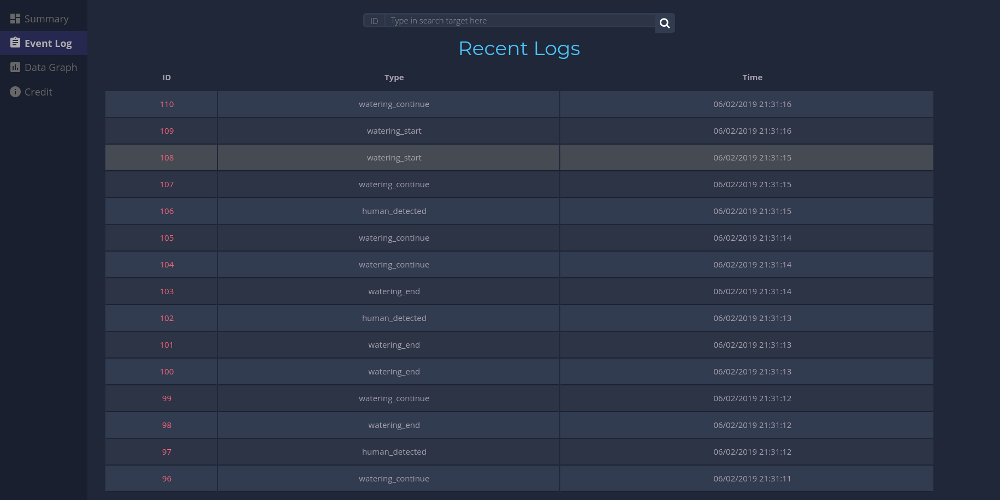

# EECS113 Final Project Webapp

.NET core webapp for eecs113 final project. Serve as the frontend for users viewing/searching the data as well as backend REST API server for logging.

## Usage Info

Main Page Address: ``` https://eecs113-final-project.azurewebsites.net```. The rest of the document will assume that this address precedes the sub URL of things like REST API.

### Features

- Summary of recent events and data: ```/Home/Summary```
- View and search all events: ```/Home/EventLog```
- Graph recent weather data: ```/Home/DataGraph```

### API

Logging Weather Data: POST request at: ```/api/Log/weather```

```json
{
    "temperature": 2,
    "water_saved": 5.1,
    "humidity": 3.5
}
```

Logging Event: POST request at: ```/api/Log/event```

```json
{
    "etype": "watering_start"
}
```

## Screenshots





## Other Info

### Azure Posgres Database

- Server name: eecs113-final-pq
- Database name: eecs113-final-db
- Server admin login: kd
- Password: 116$I!1737LyF^YGxx5
- Server Location: West US
- Resource Group: eecs113
- Collation: SQL_Latin1_General_CP1_CI_AS
- Storage: 2 Gb
- Address: ```eecs113-final-pq.postgres.database.azure.com```

## Credits

[google icon themes][1]

[table by PableraShow][2]

[chart by chart.js][3]

[w3 help file][4]

[1]: https://github.com/google/material-design-icons/blob/master/LICENSE
[2]: https://colorlib.com/wp/css3-table-templates/
[3]: https://github.com/chartjs/Chart.js
[4]: https://www.w3schools.com/w3css/default.asp
